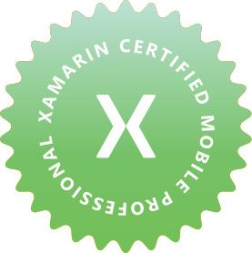

Update: on June 27th, 2018 the certification has been renewed!

On June 27th, 2017, I've passed the following Xamarin exam: [Xamarin Certified Mobile Developer](https://university.xamarin.com/certification).

Automatically I've also got the Xamarin Certified Mobile Professional certification.

