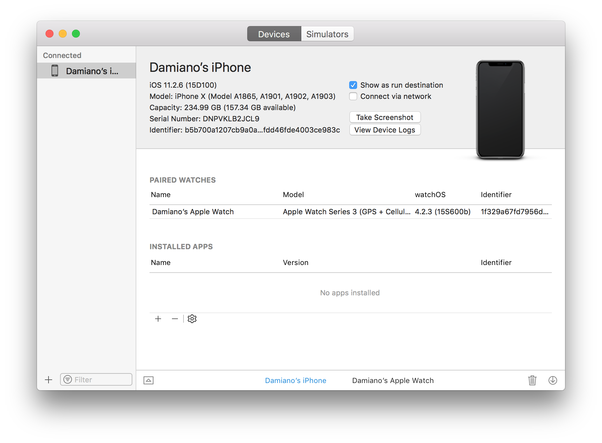
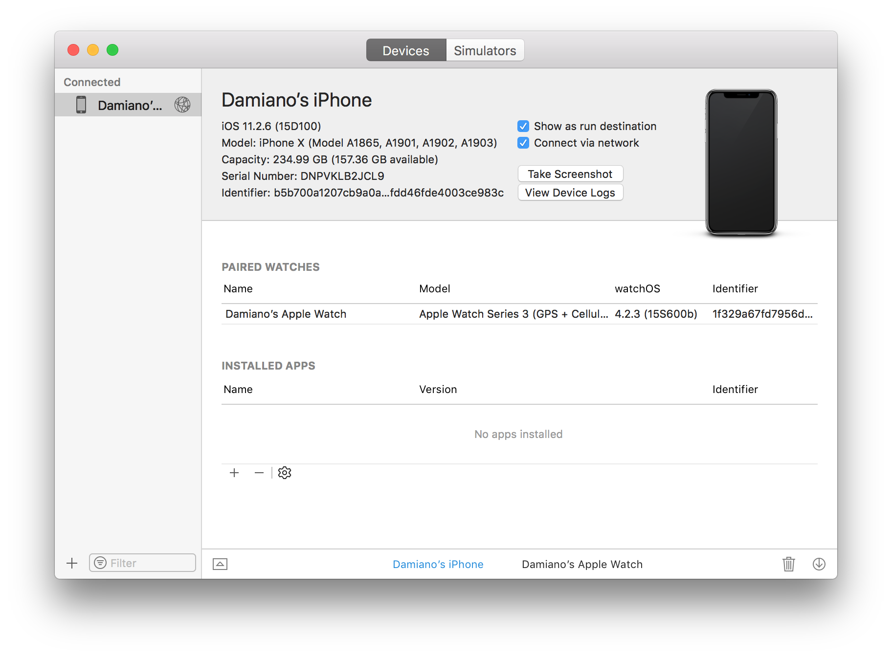

Visual Studio 2017 v15.6 and Visual Studio for Mac 7.4 introduce the possibility to debug Xamarin.iOS applications via wi-fi.

As [per Apple documentation](https://help.apple.com/xcode/mac/9.0/index.html?localePath=en.lproj#/devbc48d1bad), this requires to have installed on the Mac Xcode 9+ and iOS 11+.

How to do it? There are just a few steps to follow:
* in Xcode, connect your iPhone. Then from Window | Devices and Simulators, select your device and check "Connect via network"
  
* after checking, there should be a "world" symbol next to the iPhone:
  

This is enough to debug in both Visual Studio 2017 (note: "Connected via network")

and Visual Studio for Mac (note the wi-fi symbol)

