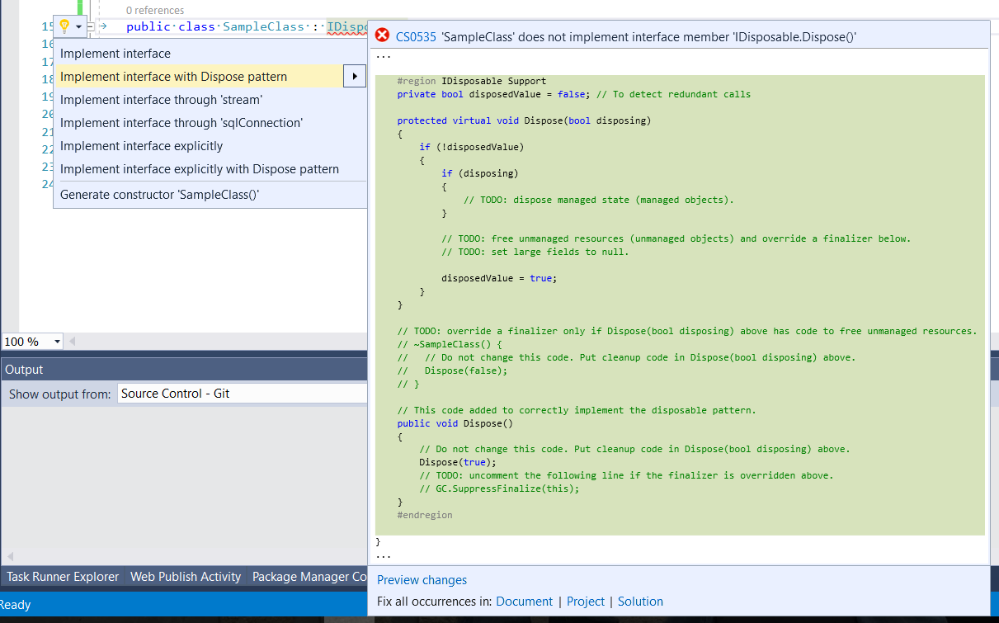

Doing multiple code reviews, I see that a recurring problem is the missing or wrong implementation of the IDisposable pattern. I try to explain it in this article.

Let's try to recreate the pattern, considering all the requirements:
* correct behavior: automatic disposition with an _using_ or _try/finally_ clause;
* incorrect behavior: the user forgets to dispose the object;
* incorrect behavior: the user disposes the object multiple times;
* incorrect behavior: the user disposes the object and then tries to use it.

Let's start, supposing we have the following class:

```csharp
public class SampleClass
{
    bool disposed = false;
    Stream stream;
    SqlConnection sqlConnection;
    IntPtr memoryRef;

    SampleClass()
    {
        stream = File.OpenRead("sample.txt");
        sqlConnection = new SqlConnection();
        memoryRef = Marshal.AllocHGlobal(1000);
    }
}
```

As the Stream and SqlConnection classes implement IDisposable, we need to dispose them; also, we need to deallocate the eventual memory referenced by IntPtr (but it could also be a native resource, like a COM or iOS/Android objects). Because of these fields, we need also to implement the IDisposable interface:

```csharp
public class SampleClass : IDisposable
{
    bool disposed = false;
    Stream stream;
    SqlConnection sqlConnection;
    IntPtr memoryRef;

    ...

    public void Dispose()
    {
        throw new NotImplementedException();
    }
}
```

We can't now start writing code directly in the Dispose method, because we should handle the case of users forgetting to dispose the class properly.

To handle this case, we will add to our class a finalizer, and in both cases we will call an overloaded Dispose method, with an additional parameter telling us if this is a properly done disposition (disposing=true) or if it is invoked by the Garbage Collector because user has forgotten to do so:

```csharp
public class SampleClass : IDisposable
{
    Stream stream;
    SqlConnection sqlConnection;
    IntPtr memoryRef;

    ...

    public void Dispose()
    {
        this.Dispose(true);
        GC.SuppressFinalize(this);
    }

    ~SampleClass()
    {
        Dispose(false);
    }

    protected virtual void Dispose(bool disposing)
    {
        throw new NotImplementedException();
    }
}
```

Note that:
* the Dispose method calls Dispose(true), to indicate a proper disposition;
* after that, we have added a call to GC.SuppressFinalize(this). This is an optimization telling the Garbage Collector to simply free our allocated memory, because the disposition of dependent object has already been done, and it simply need to release the memory allocated by the object itself;
* the Dispose(bool) method is declared as virtual, to handle class hierarchies.

Now let's focus on the Dispose(bool) method. The first important thing to know, is that it's not true that the Garbage Collector recycles unreferenced objects; instead, ++it recycles objects that aren't referenced (directly or indirectly) by root objects++. Root objects are:
* local variables in the current method;
* static variables;
* managed objects passed to COM (that works by reference counting and not by reference).

This means that, if the user forgets to dispose the object correctly, the Garbage Collector can have already disposed our managed resources, and we can't touch them. In any case, it doesn't know anything about the unmanaged resources, so we still need to deal with them:

```csharp
protected virtual void Dispose(bool disposing)
{
    if (disposing)
    {
        // Dispose managed resources
    }

    // Dispose unmanaged resources
}
```

Now: we need to remember that the user can wrongly dispose our object twice, and we need to protect against it.

We can check/set our variables for nullability, or we can use a _disposed_ variable. This variable is needed to check against usage of a disposed object, so I would suggest this approach:

```csharp
public class SampleClass : IDisposable
{
    bool disposed = false;

    ...

    protected virtual void Dispose(bool disposing)
    {
        if (disposed)
        {
            Trace.TraceWarning($"Trying to dispose class '{nameof(SampleClass)}' when it's already disposed.");
            return;
        }

        if (disposing)
        {
            // Dispose managed resources
            try { stream?.Dispose(); } finally { stream = null; }
            try { sqlConnection?.Dispose(); } finally { sqlConnection = null; }
        }

        // Dispose unmanaged resources
        if (memoryRef != IntPtr.Zero)
            try { Marshal.FreeHGlobal(memoryRef); } finally { memoryRef = IntPtr.Zero; }

        disposed = true;
    }
}
```

Finally, we need to check for possible usages of our class when it has already been disposed. We can still use the _disposed_ variable:

```csharp
public void TestMethod()
{
    if (disposed)
    {
        Trace.TraceWarning($"Trying to use method '{nameof(TestMethod) }' of class '{nameof(SampleClass)}' after it has been disposed.");
        return;
    }

    // Do something...
}
```

So here is the complete sample class:

```csharp
using System;
using System.Data.SqlClient;
using System.Diagnostics;
using System.IO;
using System.Runtime.InteropServices;

public class SampleClass : IDisposable
{
    bool disposed = false;
    Stream stream;
    SqlConnection sqlConnection;
    IntPtr memoryRef;

    SampleClass()
    {
        stream = File.OpenRead("sample.txt");
        sqlConnection = new SqlConnection();
        memoryRef = Marshal.AllocHGlobal(1000);
    }

    public void Dispose()
    {
        this.Dispose(true);
        GC.SuppressFinalize(this);
    }

    ~SampleClass()
    {
        Dispose(false);
    }

    protected virtual void Dispose(bool disposing)
    {
        if (disposed)
        {
            Trace.TraceWarning($"Trying to dispose class '{nameof(SampleClass)}' when it's already disposed.");
            return;
        }

        if (disposing)
        {
            // Dispose managed resources
            try { stream?.Dispose(); } finally { stream = null; }
            try { sqlConnection?.Dispose(); } finally { sqlConnection = null; }
        }

        // Dispose unmanaged resources
        if (memoryRef != IntPtr.Zero)
            try { Marshal.FreeHGlobal(memoryRef); } finally { memoryRef = IntPtr.Zero; }

        disposed = true;
    }

    public void TestMethod()
    {
        if (disposed)
        {
            Trace.TraceWarning($"Trying to use method '{nameof(TestMethod) }' of class '{nameof(SampleClass)}' after it has been disposed.");
            return;
        }

        // Do something...
    }
}
```

Finally, note that Visual Studio can help you with the Dispose pattern:
* when you mark a class to implement IDisposable, it can assist you into defining the skeleton of the needed methods:
  
* you can use Code Analysis rule [CA1063](https://msdn.microsoft.com/en-us/library/ms244737.aspx) to check the correct implementation of the Disposable pattern.  
  Note that there are also other rules still very useful with disposables:  
  

For additional references on the Disposable Pattern, you can also check [Dispose Pattern](https://docs.microsoft.com/en-us/dotnet/standard/design-guidelines/dispose-pattern) and [Implementing a Dispose method](https://docs.microsoft.com/en-us/dotnet/standard/garbage-collection/implementing-dispose).
