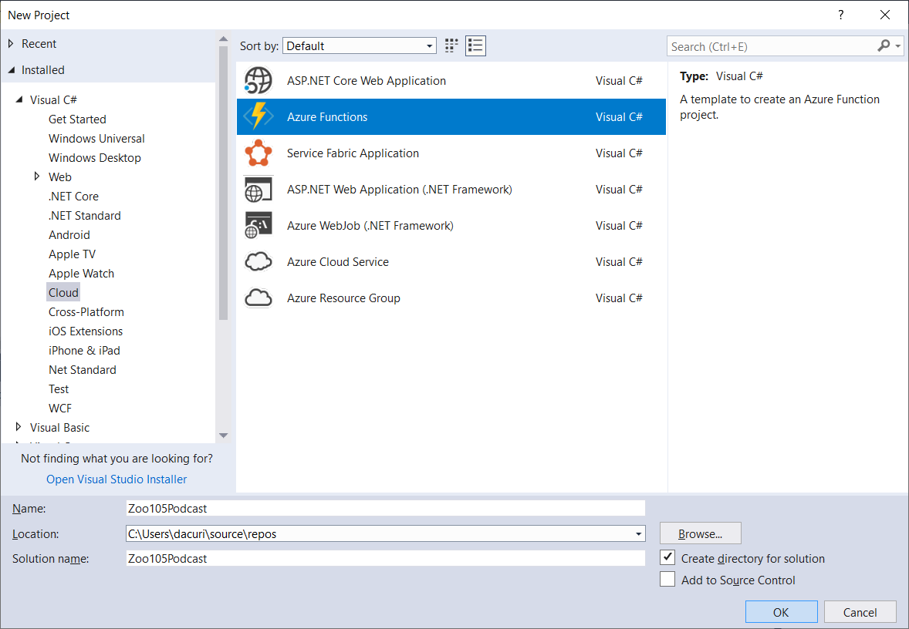
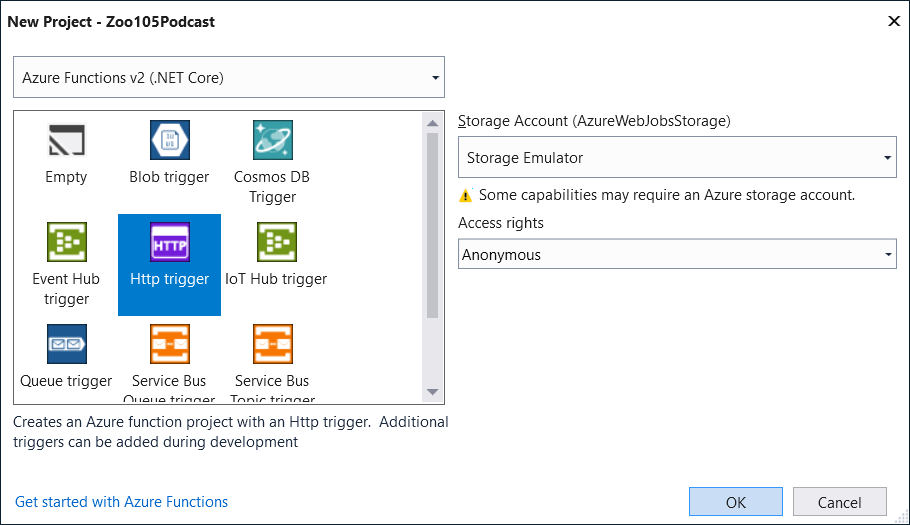
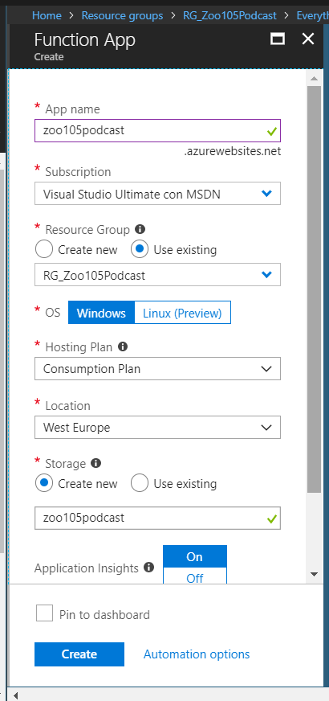
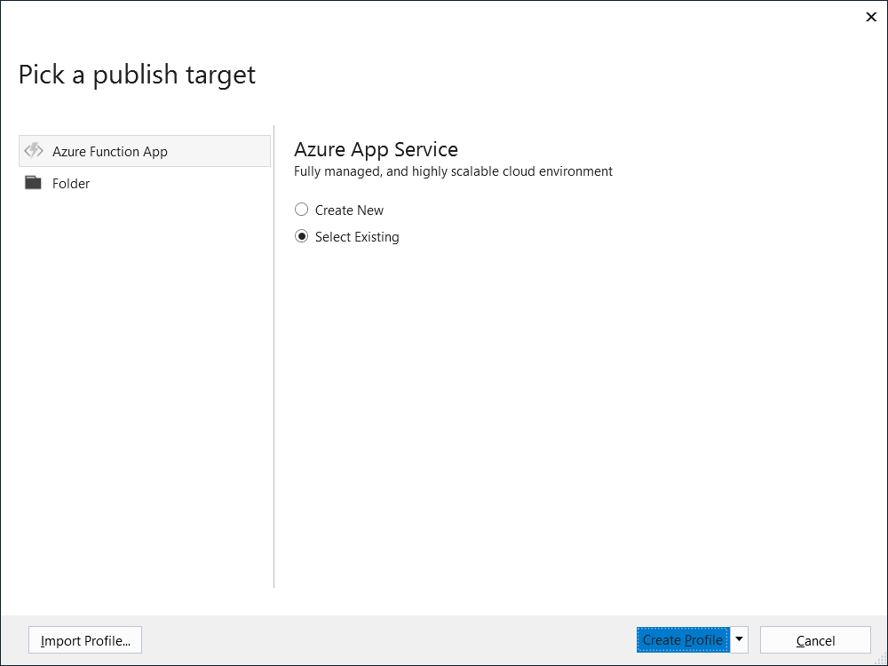
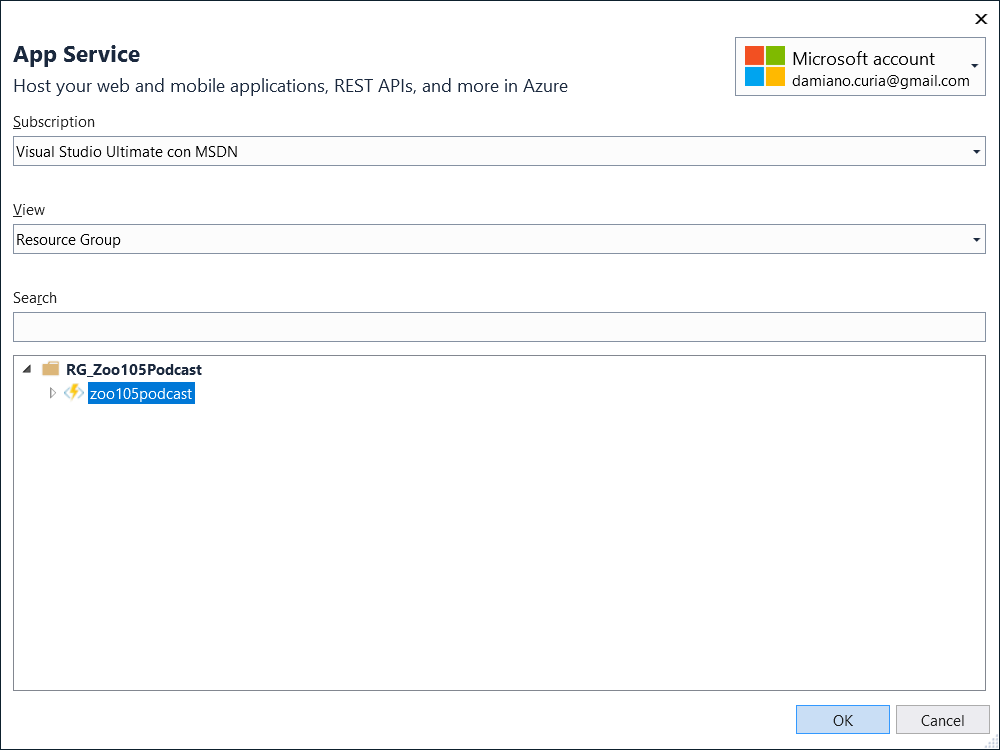

The [Zoo di 105](http://ilsitodellozoo.com/) is a very popular Italian radio program. It's a satiric program made of multiple "scenette", sketches that continue from episode to episode. While there are podcasts for these sketches, there is not a global podcast to listen to the full episodes, even if the entire episodes are fully available on the radio website.

So I had the idea of writing some code to provide an RSS feed to listen to these episodes with my favorite podcast player, when I want, without the need to sit in front of my computer.

Just FYI, the final podcast is live, published in Azure: [https://zoo105podcast.azurewebsites.net/api/Zoo105Podcast](https://zoo105podcast.azurewebsites.net/api/Zoo105Podcast). I have also published the source code in a [GitHub repository](https://github.com/curia-damiano/Zoo105Podcast).

I am going to publish three blog posts about this topic:
* introduction and Azure Function setup (this blog post);
* [adding CosmosDB](./zoo-105-podcast-adding-cosmosdb);
* [adding Azure Blob storage](./zoo-105-podcast-adding-azure-blob-storage).

**UPDATE**: all these posts have been updated to support Azure Functions v2, in .NET Core 2.1.

My first goal was to create a valid RSS feed, that would have been accepted by iTunes.

I've started with with the open-source library [PodcastRssGenerator4DotNet](https://github.com/keyvan/PodcastRssGenerator4DotNet), but it had multiple issues:
* two private methods for validation were missing from GitHub; I've obtained them decompiling the [related NuGet package](https://www.nuget.org/packages/PodcastRssGenerator4DotNet/);
* one of this method had a blocking bug, so the NuGet package couldn't be used;
* the provided sample to create the feed had also some problems with encoding;
* the generated RSS was not compliant with the W3C [feed validation service](https://validator.w3.org/feed/check.cgi?url=zoo105podcast.azurewebsites.net%2Fapi%2Fzoo105podcast).

Because of this, I've started from the source codes of this project, and then applied the required adjustments.

Another issue was how to deliver this. I chose to use Azure Functions with http input binding and xml output. Azure Functions are usually very cheap, because (with the consumption plan) you pay only for the CPU and memory you use.

If you install the Azure tools in Visual Studio 2017, you have the Azure Functions v2 template when creating a new project:



and at the next popup, select the http binding:



How to develop the core of a http invoked function and create the xml with the correct encoding:

```csharp
[FunctionName("Zoo105Podcast")]
public static async Task<IActionResult> Run([HttpTrigger(AuthorizationLevel.Anonymous, "get", "post", Route = null)]
    HttpRequest req, ILogger logger, Microsoft.Azure.WebJobs.ExecutionContext context)
{
    logger.LogInformation("C# HTTP trigger function processed a request.");

    var config = new ConfigurationBuilder()
        .SetBasePath(context.FunctionAppDirectory)
        .AddJsonFile("local.settings.json", optional: true, reloadOnChange: true)
        .AddEnvironmentVariables()
        .Build();

    // Change to a culture that has the correct date and time separators
    Thread.CurrentThread.CurrentCulture = new System.Globalization.CultureInfo("it-IT");

    // Podcast code taken initiallly from https://github.com/keyvan/PodcastRssGenerator4DotNet/blob/master/PodcastRssGenerator4DotNet/PodcastRssGenerator4DotNet.Test/Default.aspx.cs
    // How apply encoding to XmlWriter: https://stackoverflow.com/questions/427725/how-to-put-an-encoding-attribute-to-xml-other-that-utf-16-with-xmlwriter
    using (MemoryStream memoryStream = new MemoryStream())
    {
        XmlWriterSettings settings = new XmlWriterSettings
        {
            Encoding = Encoding.UTF8
        };

        using (XmlWriter writer = XmlWriter.Create(memoryStream, settings))
        {
            RssGenerator generator = await GetGeneratorAsync(config);
            generator.Generate(writer);
        }

        string xmlString = settings.Encoding.GetString(memoryStream.ToArray());

        return new ContentResult
        {
            Content = xmlString.ToString(),
            ContentType = "application/rss+xml"
        };
    }
}
```

**UPDATE**: note that now the class TraceWriter is obsolete, so it's better to upgrade to ILogger.

**UPDATE**: if upgrading from the previous version, it's also important to leave the FUNCTION_WORKER_RUNTIME key in the local.settings.json (that gets created by default when creating a new empty function v2):

```json
{
    "IsEncrypted": false,
    "Values": {
        "AzureWebJobsStorage": "UseDevelopmentStorage=true",
        "FUNCTIONS_WORKER_RUNTIME": "dotnet"
    },
    "MaxNumberEpisodesToReturn": "5",
    "MaxNumberDaysWithoutPodcast": "5"
}
```

After finishing this first step of the project (that you can find in GitHub with the Tag "AzureFunctionHttp"), you will need to publish to Azure.

After having created a dedicated Resource Group, you can create your Azure Function App, as shown in the following picture:



With it, you can finally publish from Visual Studio: first choose to use an existing Azure App Service:



then selected the App Service just created:



At this point you should be able to test your function via the http binding (mine is at [https://zoo105podcast.azurewebsites.net/api/Zoo105Podcast](https://zoo105podcast.azurewebsites.net/api/Zoo105Podcast)).

The source code for this step is available in the dedicated [GitHub repository](https://github.com/curia-damiano/Zoo105Podcast), under the tag [1.AzureFunctionHttp](https://github.com/curia-damiano/Zoo105Podcast/releases/tag/1.AzureFunctionHttp).
