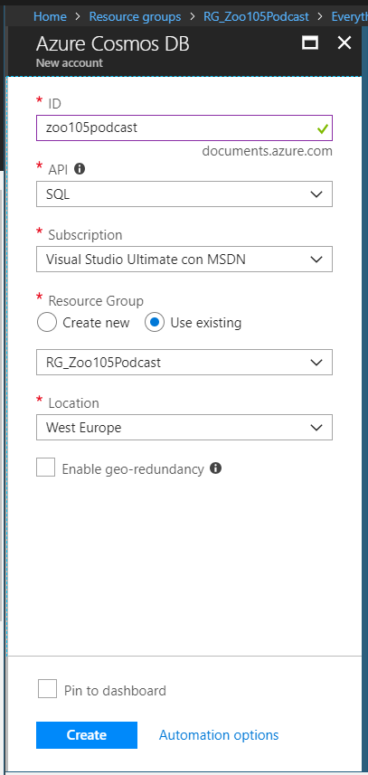

After having developed the first version of the podcast feed, I wanted to improve it. My idea was to cache the data already got from the http endpoint, to achieve two goals:
* improve performances;
* avoid that with an increasing number of users using my podcast feed, I (my podcast) would do many requests to the http endpoint.

As a caching mechanism I've chosen to use [CosmosDB](https://docs.microsoft.com/en-us/azure/cosmos-db/), a NoSQL database that has the big advantage of paying for use, completely in line with the Azure Functions mindset.

To use CosmosDB in a .NET Core application, first of all you need to include the [Microsoft.Azure.DocumentDB.Core](https://www.nuget.org/packages/Microsoft.Azure.DocumentDB.Core/) NuGet package.

The data is organized in Databases, Collections (equivalent to a SQL tables) and Documents (equivalent to SQL records). Documents are json files, serialized/deserialized to/from POCO entities with Json.Net.

This is reflected about how to create a Collection (if not existing) and return a DocumentClient:

```csharp
public static async Task<DocumentClient> GetCosmosDBClientAsync(IConfiguration config)
{
    Uri cosmosDBEndpointUri = new Uri(config["CosmosDBEndpointUrl"]);
    string cosmosDBPrimaryKey = config["CosmosDBPrimaryKey"];

    DocumentClient cosmosDBClient = new DocumentClient(cosmosDBEndpointUri, cosmosDBPrimaryKey);

    await cosmosDBClient.CreateDatabaseIfNotExistsAsync(new Database { Id = dbName });
    await cosmosDBClient.CreateDocumentCollectionIfNotExistsAsync(UriFactory.CreateDatabaseUri(dbName), new DocumentCollection { Id = collectionName });

    return cosmosDBClient;
}
```

After you have a DocumentClient, you can call its methods to get,

```csharp
var tempResult = await cosmosDBClient.ReadDocumentAsync(UriFactory.CreateDocumentUri(dbName, collectionName, podcastId));
PodcastEpisode result = (dynamic)tempResult.Resource;
```

save,

```csharp
Uri documentCollectionUri = UriFactory.CreateDocumentCollectionUri(dbName, collectionName);
await cosmosDBClient.CreateDocumentAsync(documentCollectionUri, episode);
```

and update documents:

```csharp
Uri documentUri = UriFactory.CreateDocumentUri(dbName, collectionName, episode.Id);
await cosmosDBClient.ReplaceDocumentAsync(documentUri, episode);
```

About the POCO entities: if you don't want that CosmosDB assigns them a GUID id, then they need to have an "id" property (all in lower case). If you want to use the usual C# naming conventions, you can use tag your property with JsonProperty:

```csharp
public class PodcastEpisode
{
    // Id of the podcast, in format yyyyMMdd
    [JsonProperty(PropertyName = "id")]
    public string Id { get; set; }
    public DateTime DateUtc { get; set; }
    public string FileName { get; set; }
    public Uri CompleteUri { get; set; }
    public long FileLength { get; set; }
}
```

When deploying the solution in Azure, you need to create the CosmosDB instance with API: SQL



The source code for this step is available in the dedicated [GitHub repository](https://github.com/curia-damiano/Zoo105Podcast), under the tag [2.CosmosDB](https://github.com/curia-damiano/Zoo105Podcast/releases/tag/2.CosmosDB).
