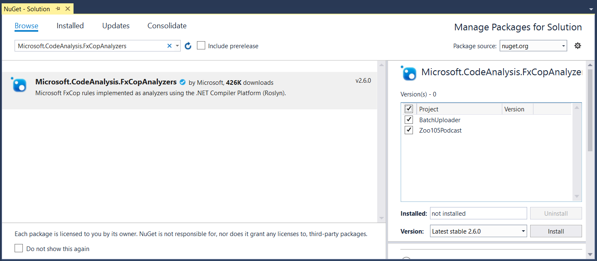
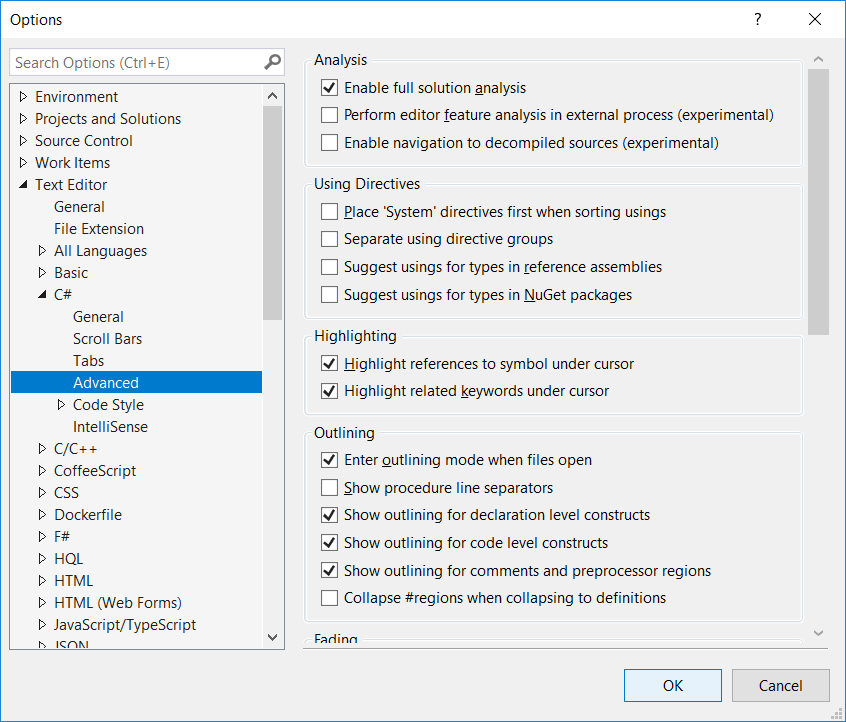
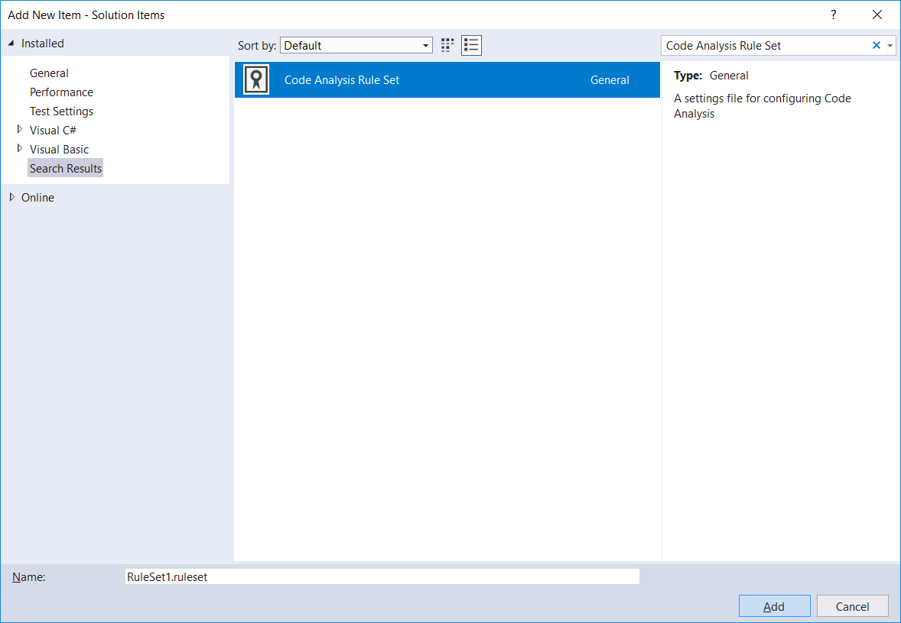
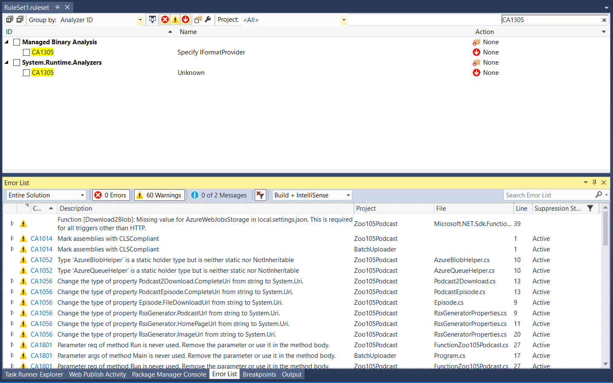

[Code Analysis](https://docs.microsoft.com/en-us/visualstudio/code-quality/code-analysis-for-managed-code-overview) (formerly [FxCop](https://msdn.microsoft.com/en-us/library/bb429476(v=vs.80).aspx)) is a very powerful tool to help improving the code quality in .NET projects.

Let's make a bit of history: the previous version of this tool (FxCop) worked analyzing the compiled assemblies, searching for pattern of improvable code, in different areas, like for example performance, globalization, and so on.

With .NET Core, we have a new generation of Roslyn analyzers that work instead during compile time, and even when you type your code in the editor! Additionally, they usually offer code fixes (in Visual Studio: Quick Actions) that help to automatically fix the found issues.

In this post, I will go through its setup, as it is different from the previous FxCop setup.

1. First of all, the biggest difference is how they are included in the projects. You can follow [Configure and use Roslyn analyzer rules,](https://docs.microsoft.com/en-us/visualstudio/code-quality/use-roslyn-analyzers) but more simply, it's enough to add a NuGet package, [Microsoft.CodeAnalysis.FxCopAnalyzers](https://www.nuget.org/packages/Microsoft.CodeAnalysis.FxCopAnalyzers/), to all projects of your solution that you want to analyze:  

   

2. Enable [Full Solution Analysis](https://docs.microsoft.com/en-us/visualstudio/code-quality/how-to-enable-and-disable-full-solution-analysis-for-managed-code#to-toggle-full-solution-analysis) from Tools, Options, Text Editor, C#, Advanced, Enable Full Solution Analysis:  

   

3. Create a new RuleSet file at solution level. You can do this right-clicking on the solution itself or on a solution folder and adding a new item of type Code Analysis Rule Set:  

   

4. Edit the rule set file and set all the action for every issue type to Warning.  
   This should be your starting point; in the next steps, we will remove the rules we don't need.  

5. Associate each project to the rule file.  
   To do this, open each project file (right click, Edit &lt;project&gt;.csproj) and add the following tag to a PropertyGroup (what you insert, is the rule set file name, including its path relative to the position of the csproj file itself):  

```markup
<PropertyGroup>
    ...
    <CodeAnalysisRuleSet>..\RuleSet1.ruleset</CodeAnalysisRuleSet>
</PropertyGroup>
```

6. Due to a [temporary bug](https://github.com/dotnet/project-system/issues/3573), even when you choose to disable a rule at Rule Set level, it's possible that the warnings don't go away. Look for example at the picture here below: I have de-flagged the rule CA1305, but even after a full rebuild, the warning are still there:  

   

   So, you need to edit the rule set file manually to disable this rule.  
   You need to find in which group the rule is defined, and for this you can check the GitHub analyzer repository [README](https://github.com/dotnet/roslyn-analyzers/blob/master/README.md). In case you don't find it, I suggest searching by text in all the repository, like [this search query](https://github.com/dotnet/roslyn-analyzers/search?q=ca1305&unscoped_q=ca1305).  
   In particular, from [Analyzers_ShippingRules.ruleset](https://github.com/dotnet/roslyn-analyzers/blob/86ffe2c710f273ace3d2020d8365a5eff2a973b9/eng/Analyzers_ShippingRules.ruleset) of the previous search, we determine the **AnalzyerId** and the **RuleNamespace**, to be used in our modification of the rule set file:  

  ```markup
  <?xml version="1.0" encoding="utf-8"?>
  <RuleSet Name="New Rule Set" Description=" " ToolsVersion="15.0">
      ...
      <Rules AnalyzerId="System.Runtime.Analyzers" RuleNamespace="System.Runtime.Analyzers">
          <Rule Id="CA1305" Action="None" />
      </Rules>
  </RuleSet>
  ```

7. After have done all of this, recompiling the project will not show the unwanted rules anymore. Here you can see that the rule CA1305 is not there anymore:  

   

++**Important tip**++: there is possibly a final optimization, that you can apply if:
* you want to analyze all projects of a solution;
* and all projects relative paths to the rule set file are the same.

If the two conditions are above are satisfied, then you can leverage what described in [Customize your build](https://docs.microsoft.com/en-us/visualstudio/msbuild/customize-your-build): you can add the NuGet package and configure the rule set file for all projects in the solution, simply creating an external file in the build root folder of your solution.

So, you need to create at the solution level a new file called **Directory.Build.props** with the following content:

```markup
<Project>

    <PropertyGroup>
        <CodeAnalysisRuleSet>$(SolutionDir)RuleSet1.ruleset</CodeAnalysisRuleSet>
    </PropertyGroup>

    <ItemGroup>
        <PackageReference Include="Microsoft.CodeAnalysis.FxCopAnalyzers" Version="3.3.2" />
    </ItemGroup>

</Project>
```

Following the above hint, here the final order of steps to configure Code Analysis in .NET Core:
1. Add at the solution level the file Directory.Build.props with the content shown here above;
2. Enable Full Solution Analysis;
3. Create a new Rule Set file;
4. Edit the Rule Set file, configuring all types of issues to Warning;
5. To fix the temporary bug, add the missing rules when needed;
6. Rebuild your project.

## Update on January 2021
The NuGet package [Microsoft.CodeAnalysis.FxCopAnalyzers](https://www.nuget.org/packages/Microsoft.CodeAnalysis.FxCopAnalyzers) is now declared obsolete and you should use [Microsoft.CodeAnalysis.NetAnalyzers](https://www.nuget.org/packages/Microsoft.CodeAnalysis.NetAnalyzers) instead.
