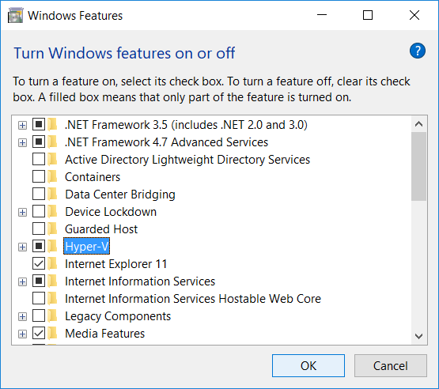
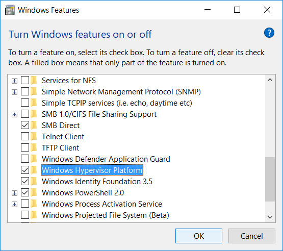
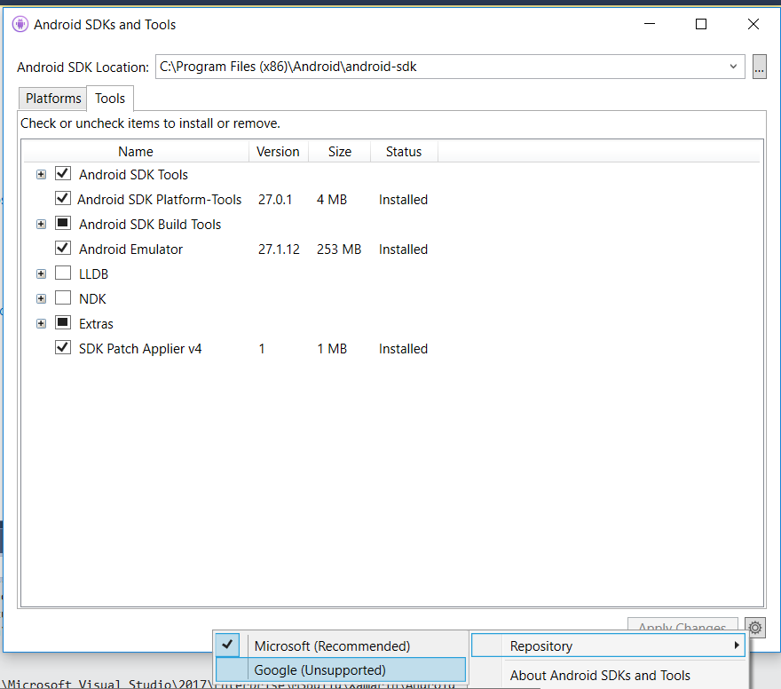
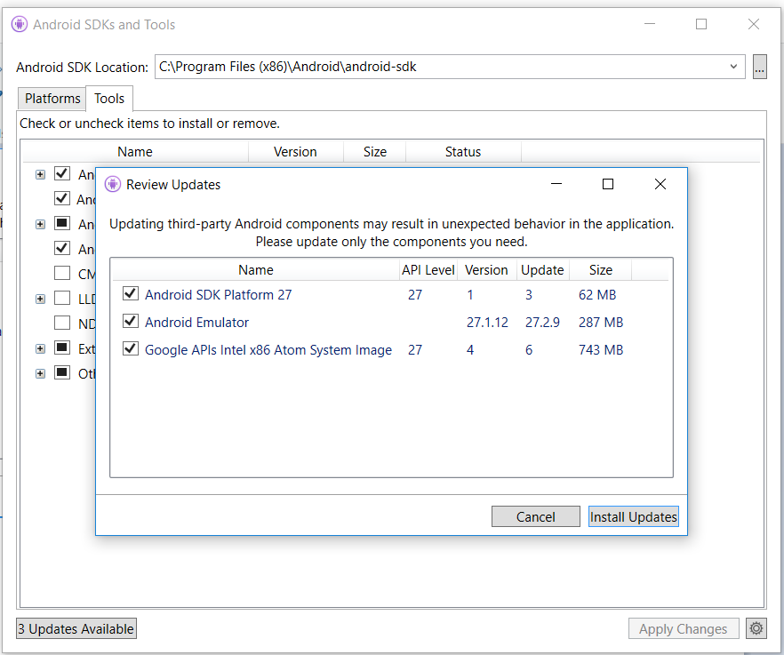

At Build 2018, Microsoft has [announced the Hyper-V support for the Google Android emulators](https://blogs.msdn.microsoft.com/visualstudio/2018/05/08/hyper-v-android-emulator-support/). Before discussing about this, let's have an introduction about how we have arrived here.

Traditionally, the Google Android emulators were running in Java Virtual Machines, so they were terribly slow. I remember the panic that I felt when by accident I closed the running emulators, instead of killing the application I was debugging. The time for the shutdown, plus the restart of the emulators, would take many minutes.

With Visual Studio 2015, Microsoft introduced the [Hyper-V Android emulators](https://www.visualstudio.com/vs/msft-android-emulator/). They have been rewritten by Microsoft, running as physical virtual machines in Hyper-V. So they were really very fast and very welcome!  
But: they were not including support for the Google Play services (Store in primis), because, while the emulators by themselves are free, the Google Play services are not. After some time, in Internet it was possible to find multiple "escamotages" to install the Google Play services on these emulators, but clearly it was not an ideal situation.

So, Microsoft stopped developing them (even if they are still available are separate download), above all considering the introduction of the [Intel HAXM support for the Google Android emulators](https://developer.android.com/studio/run/emulator-acceleration). Practically Google has found a solution similar to Microsoft's, allowing to run its emulators on physical hardware. This solution allowed the "original" (i.e. by Google) emulators to run finally fast, on both PC and Mac, but it had a few problems too:
* it was not working on AMD processors;
* it was incompatible with Hyper-V, so it didn't play well with Microsoft Phone emulators, or recently with Docker; this means that to run the HAXM emulators, you need to uninstall Hyper-V and reboot the machine; another reboot is required if you want to reinstall Hyper-V;
* additionally, it created problems on some enterprise computers.

As anticipated at the beginning of this post, at Build 2018 Microsoft has announced Hyper-V support for the native Google Android emulators, allowing:
* "original" Google Android emulators, with all the benefits that you can imagine: immediate updates, Google Play services, [quick boot](https://developer.android.com/studio/run/emulator#quickboot), and so on;
* virtualization based on Hyper-V, so support for AMD processors (to come in version 27.3.1) and ability to coexist together with Docker.

How to enable it? It's not difficult, if you follow all steps carefully.
1. If you haven't already installed it, update Windows 10 to the April 2018 update (version 1803).  
   This is required, because Microsoft has added a feature in Windows to allow third party application to use its own virtualization system.  

2. Enable ++both++ **Hyper-V** and the **Windows Hypervisor Platform**, then reboot your machine:  

   

   

3. From the Android SDKs and Tools dialog, change the **Repository** to Google:  

   

   then update the Android Emulator  

   

4. ~~Add to the file **advancedFeatures.ini** in the folder **~/.android** (so, in my personal case, the full path and filename is C:\Users\dacuri\.android\advancedFeatures.ini) the following content:~~ 

```ini
WindowsHypervisorPlatform=on
```

**Important**: very probably the file will be missing, so create it. The location is indeed correct!
**Note**: there are other advancedFeatures.ini files in your computer, but you need to modify/add only this one!

Update after recent announcement by Google: [Android Emulator - AMD Processor & Hyper-V Support](https://android-developers.googleblog.com/2018/07/android-emulator-amd-processor-hyper-v.html), wtih Android Emulator version v27.3.8:
* the above advancedFeatures.ini file is not required anymore;
* Intel Processor : Intel® Core™ processor that supports Virtualization Technology (VT-x), Extended Page Tables (EPT), and Unrestricted Guest (UG) features. Additionally VT-x needs to be enabled in the BIOS;
* in alternative, AMD Processor - Recommended: AMD® Ryzen™ processors.

You can refer to the official [Android documentation](https://developer.android.com/studio/run/emulator-acceleration) to technical details and troubleshooting.
