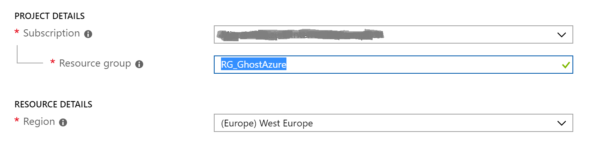
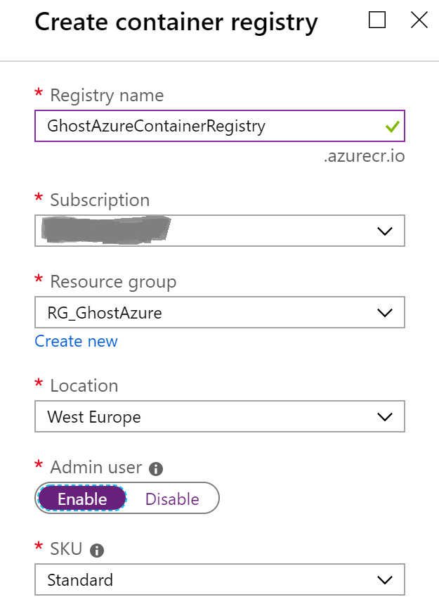
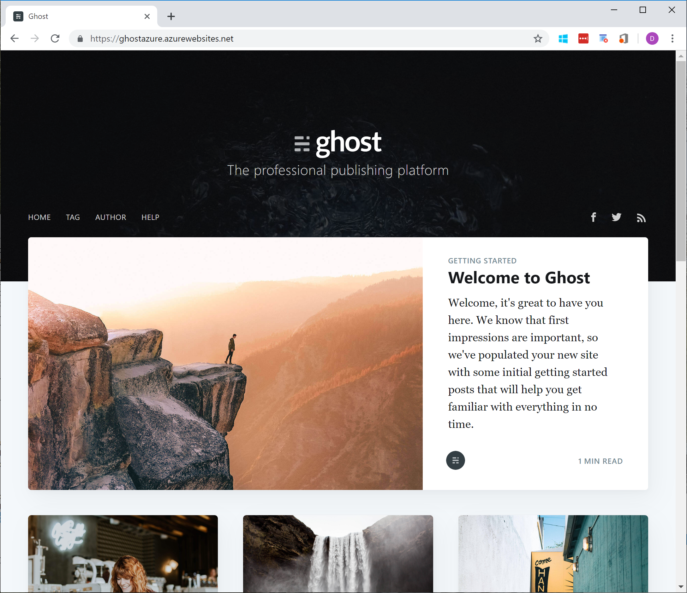
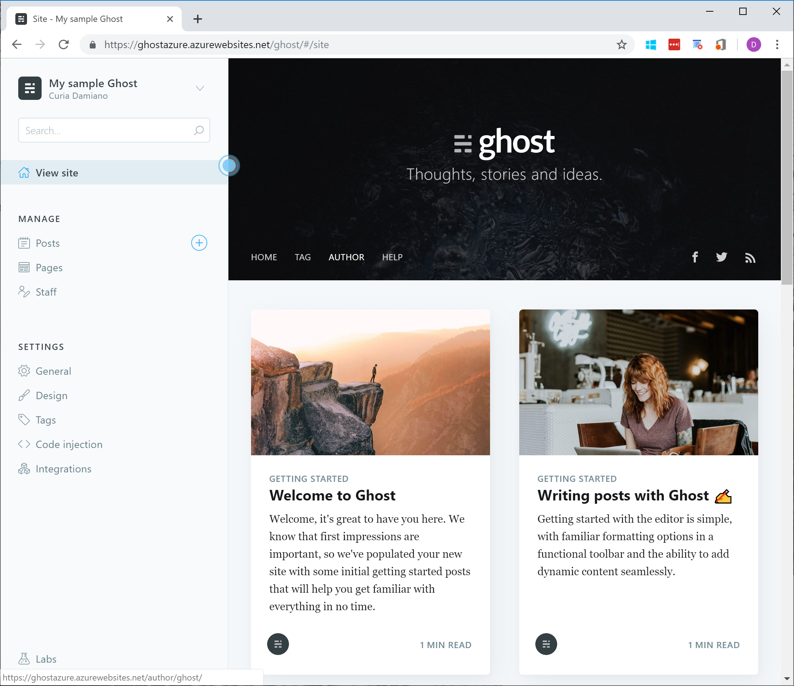

During my past holidays, I have migrated my blog from [Blogifier](http://blogifier.net/) to [Ghost](https://ghost.org/).
The main reason of this move has been the lack of development of Blogifier (and even before, similar issues with [BlogEngine](https://blogengine.io/)).

I have initially tried to deploy it via CI/CD from the official [GitHub repository](https://github.com/TryGhost/Ghost), but this would have required some code changes to adjust it for Azure.
Because of this, I've followed the tips and recommendations of my colleague and friend [Gareth Emslie](https://blog.soft-cor.com/) to use containers.
The advantage of this approach is that you start from the original Ghost image, and then it gets customized with new features already implemented by Gareth.
The cool thing is that in this way, when a new Ghost image will be released, Azure will automatically download it, apply the customizations, and finally update the running App Service.

In this post I will go now through [Gareth's post](https://blog.soft-cor.com/how-i-am-running-ghost-on-azure/) and highlight the information that has been useful to me.

1. Gareth has already created a [GitHub repository](https://github.com/keyoke/docker-ghost-ai) with his customized DOCKERFILE where he adds Application Insights to the base Ghost image.
    I have cloned it in [my repository](https://github.com/curia-damiano/docker-ghost-ai), and you should do it too if you want to setup your personal blog based on Ghost.

2. Log in into your GitHub account, click on the top right to your profile icon, Settings, Developer Settings, Personal Access Token, click Generate new token, flag all the "repo" check-boxes, give a name like "Azure Container Registry", click Generate token, and copy the GitHub token.

3. Create a Resource Group in Azure where you will place all the following resources. In my case I have called it *RGGhostAzure*.
   

4. Create a new resource of type Azure Container Registry, give a name like *GhostAzureContainerRegistry* and enable the Admin user.
   

5. If not already done, enable the Azure CLI. From the Azure portal, click on the top right the icon with ">_" and create the necessary Azure storage.

6. Create the Azure Container Registry with the following Azure CLI command:

   ```batch
   az acr task create \
      --registry [ACR_REGISTRY_NAME] \
      --name docker-ghost-ai \
      --image ghost:2-alpine-ai \
      --context https://github.com/[YOUR ACCOUNT]/docker-ghost-ai.git \
      --branch master \
      --file 2/alpine/ai/DOCKERFILE \
      --git-access-token [GIT_ACCESS_TOKEN]
   ```

   In my case it is something like:

   ```batch
   az acr task create \
      --registry GhostAzureContainerRegistry \
      --name docker-ghost-ai \
      --image ghost:2-alpine-ai \
      --context https://github.com/curia-damiano/docker-ghost-ai.git \
      --branch master \
      --file 2/alpine/ai/DOCKERFILE \
      --git-access-token 690**********************************c15
   ```

7. Start the task with the following Azure CLI command:

   ```batch
      az acr task run --registry [ACR_REGISTRY_NAME] --name docker-ghost-ai
   ```

   In my case it is something like:

   ```batch
      az acr task run --registry GhostAzureContainerRegistry --name docker-ghost-ai
   ```

8. Check that the process is finished with the following Azure CLI command:

   ```batch
      az acr task list-runs --registry [ACR_REGISTRY_NAME] --output table
   ```

   In my case it is something like:

   ```batch
      az acr task list-runs --registry GhostAzureContainerRegistry --output table
   ```

   (the status must switch from Running to Succeded)

9. Create the App Service choosing a Web App.
   * Give a name like *GhostAzure*, choose to publish via Docker Image and keep Linux as Operative System;
     

   * From the second tab, as Image Source choose Azure Container Registry and verify that the following fields are filled in based on your previous steps;
     

   * It's not possible to create Application Insights at this point, we will do very shortly later

10. Create a new instance of Application Insights and take note of its Instrumentation Key (after creation, go to the Overview tab)
    

11. Create a new Azure Storage instance, for example calling it *ghostazurestorage*.
    

    After the storage gets created, select Blobs, and create a new Container called *databaseblob*. 
    

    Then go back, select the Files, and create a File Share called *contentfiles*.  
    

12. We are ready now to complete the configuration of our Ghost installation. Select the GhostAzure web application and in the Configuration tab add the following application settings:

    | Name                           | Value                                |
    | ------------------------------ | ------------------------------------ |
    | APPINSIGHTS_INSTRUMENTATIONKEY | *paste here your App Ins instrumentation key* |
    | database__connection__filename | /var/lib/ghost/content_blob/ghost.db |
    | GHOST_CONTENT                  | /var/lib/ghost/content_files/        |
    | NODE_ENV                       | production                           |
    | paths__contentPath             | /var/lib/ghost/content_files/        |
    | privacy__useUpdateCheck        | false                                |
    | url                            | *set here your final url*            |

    At the end, remember to save the settings.

13. Now go to the Path Mappings tab (still under Configuration) and add the following mounts:

    | Key               | Value                       |
    | ----------------- | --------------------------- |
    | Name              | ContentBlobVolume           |
    | Storage accounts  | ghostazurestorage           |
    | Storage type      | Azure Blob                  |
    | Storage container | databaseblob                |
    | Mount path        | /var/lib/ghost/content_blob |

    | Key               | Value                        |
    | ----------------- | ---------------------------- |
    | Name              | ContentFilesVolume           |
    | Storage accounts  | ghostazurestorage            |
    | Storage type      | Azure Files                  |
    | Storage container | contentfiles                 |
    | Mount path        | /var/lib/ghost/content_files |

    At the end, remember to save the settings.

14. Finally you can access your new Ghost blog hosted in Azure:
    

    Go to the /ghost path to create the admin account and start creating your new blogs!
    
