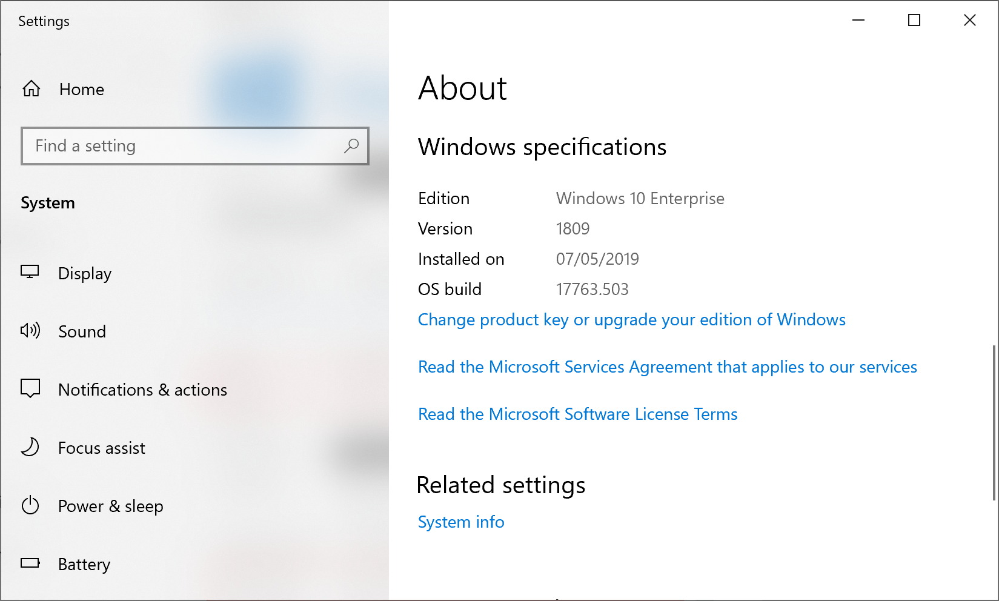
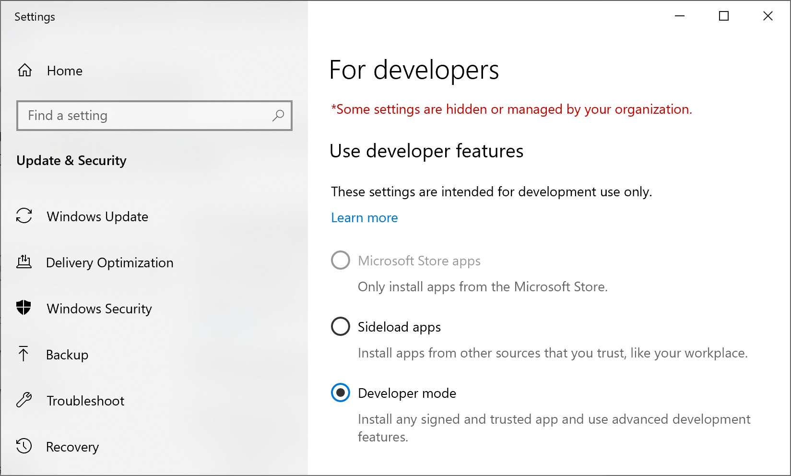
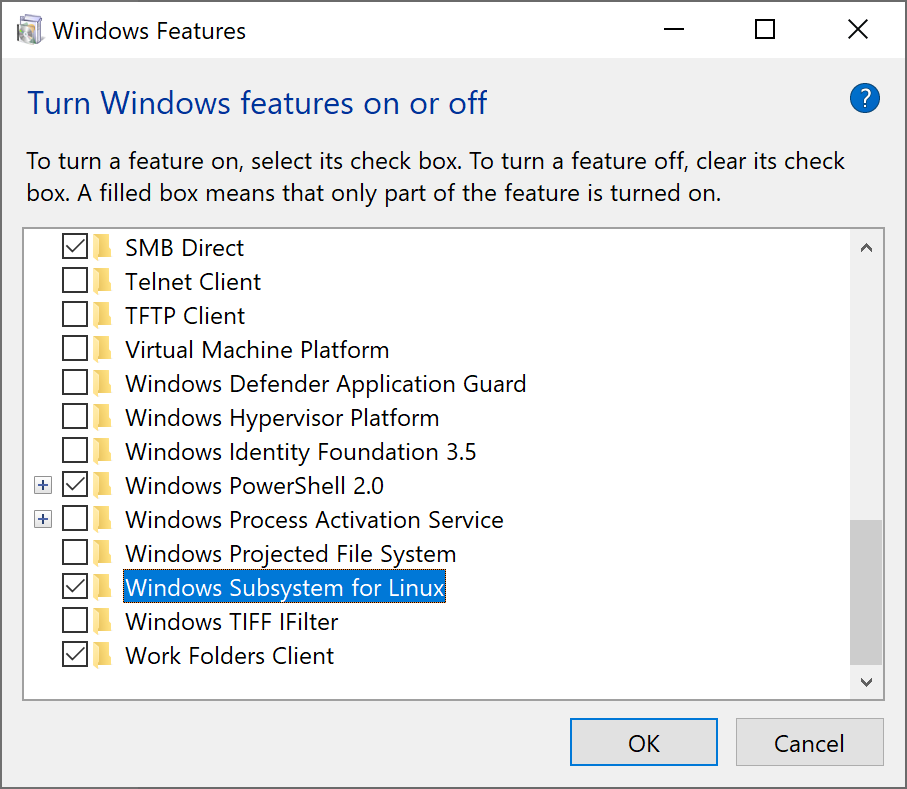
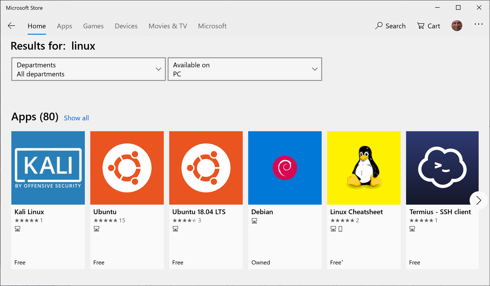
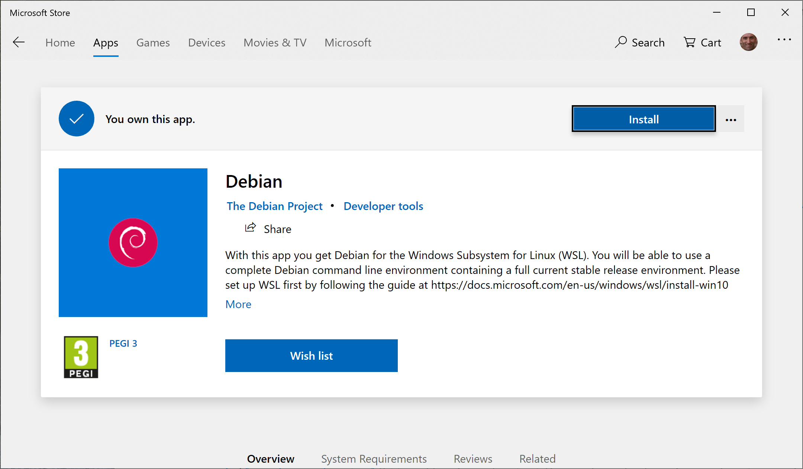
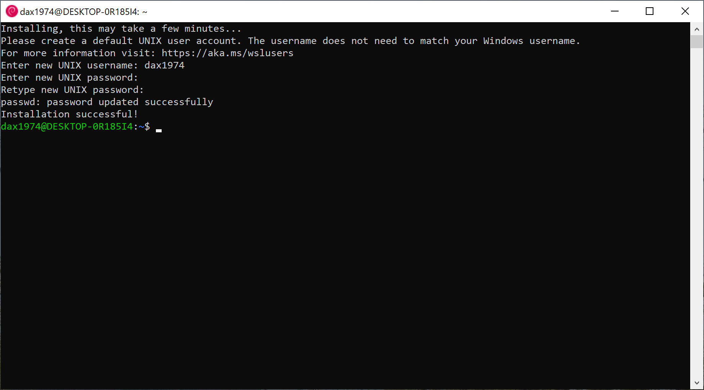
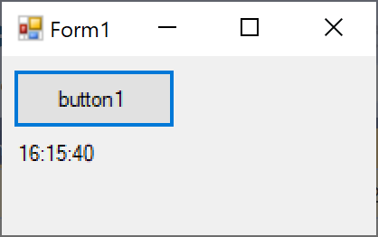
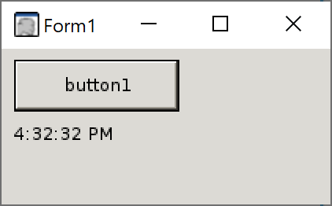

In this guide, I will present you the Windows Subsystem for Linux (WSL) and how to develop graphical Linux applications on Windows with Visual Studio, thanks to Mono used as the runtime.

First you need to check that your Windows version is [at least 1607](https://en.wikipedia.org/wiki/Windows_Subsystem_for_Linux) (Falls Creator Update). Check your Windows version from Settings | System | About:


Then you need to enable Developer mode on Windows, from Settings | Update & Security | For developers, and switch to developer mode:


Now you can enable the WSL from Start | Turn Windows features on or off, choose "Windows Subsystem for Linux" (this will make your machine to reboot).


From the Microsoft Store, it's time choose your favorite Linux distro. In my case, I will use Debian, but other choices are also possible:



Lunch the app from the store, it will finish the initial configuration.
It will ask you to create a local user (completely disconnected from your Windows account).


Update the Debian installation with the following command:

```bash
sudo apt-get update && sudo apt-get upgrade -y && sudo apt-get upgrade -y && sudo apt-get dist-upgrade -y && sudo apt-get autoremove -y
```

Install on your machine an X-server, for example [VcXsrv](https://sourceforge.net/projects/vcxsrv/).
Start it for the first time (you can also choose to auto-start it in Windows).

In the Linux subsystem, configure the local X server with the following command:

```bash
echo "export DISPLAY=localhost:0.0" >> ~/.bashrc
```

Restart bash, or run the following command:

```bash
. ~/.bashrc
```

In Visual Studio, create now a regular Windows Forms app.
In my case, I place on the main form a button and a label, and on the button click I update the label text with the current time:

```csharp
private void Button1_Click(object sender, EventArgs e)
{
  label1.Text = DateTime.Now.ToLongTimeString();
}
```

We start our app on Windows, nothing surprising:


Let's install Mono on Linux:

```bash
sudo apt install mono-complete
```

From the Linux shell, browse to the folder containing the output of your app (the C disk is mounted under /mnt/c), then start the app with Mono:

```bash
cd /mnt/c/_Works/WinFormsTest/bin/Debug/
mono WinFormsTest.exe
```



In case of issues when starting the Mono app in Linux, try to run the following command:

```bash
sudo apt --fix-broken install
```

References:
* [How to run graphical Linux applications on Bash on Ubuntu on Windows 10](https://seanthegeek.net/234/graphical-linux-applications-bash-ubuntu-windows/)
* [Running .Net WinForms Applications with Mono](http://comfilewiki.co.kr/en/doku.php?id=comfilepi:running_.net_winforms_applications_with_mono:index)
* [SSH on Windows Subsystem for Linux](https://www.illuminiastudios.com/dev-diaries/ssh-on-windows-subsystem-for-linux/)
