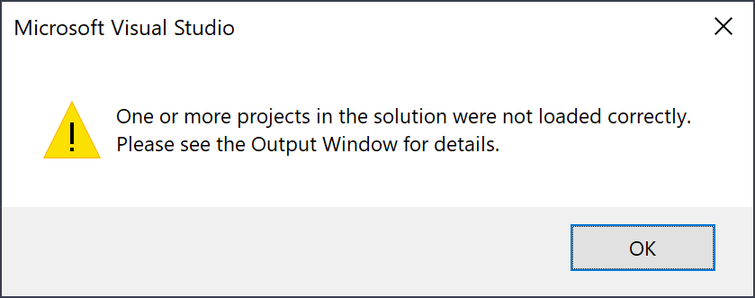
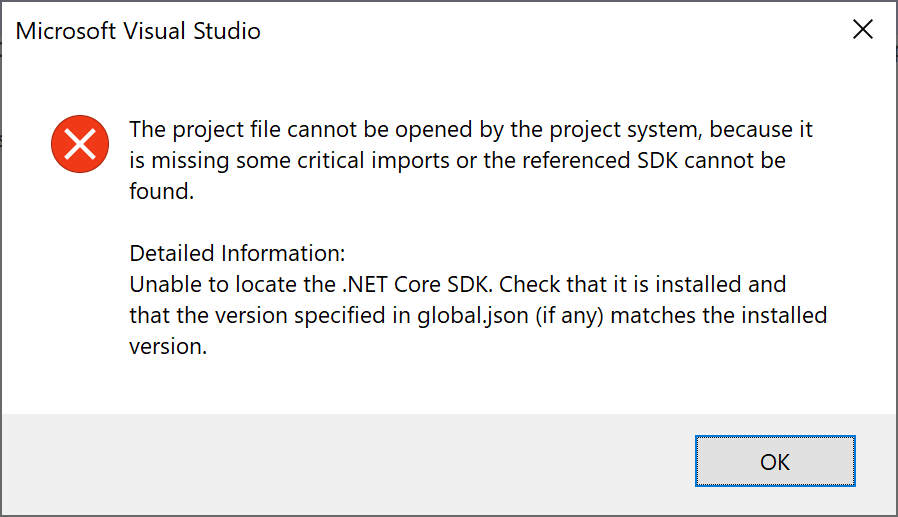

It happened to me, recently, to work on multiple .NET Core solutions from various customers, but I was not able to open them. Or better: Visual Studio was able to open the solution, but it couldn't load any of the contained projects.

First it showed the following error message: "One or more projects in the solution were not loaded correctly. Please see the Output Window for details."

Then the Solution Explorer showed all .NET Core projects unloaded.

The Output Window displayed the following message for each of the unloaded projects: "C:\xxx\MyProject.csproj : error  : The project file cannot be opened by the project system, because it is missing some critical imports or the referenced SDK cannot be found. Detailed Information: Unable to locate the .NET Core SDK. Check that it is installed and that the version specified in global.json (if any) matches the installed version."

As the message says, the issues is that there must be a [global.json](https://docs.microsoft.com/en-us/dotnet/core/tools/global-json) file in the folder structure, that specifies a .NET Core SDK that is not installed on the local machine.
You can simply fix the issue updating the global.json file, or installing the required SDK.
