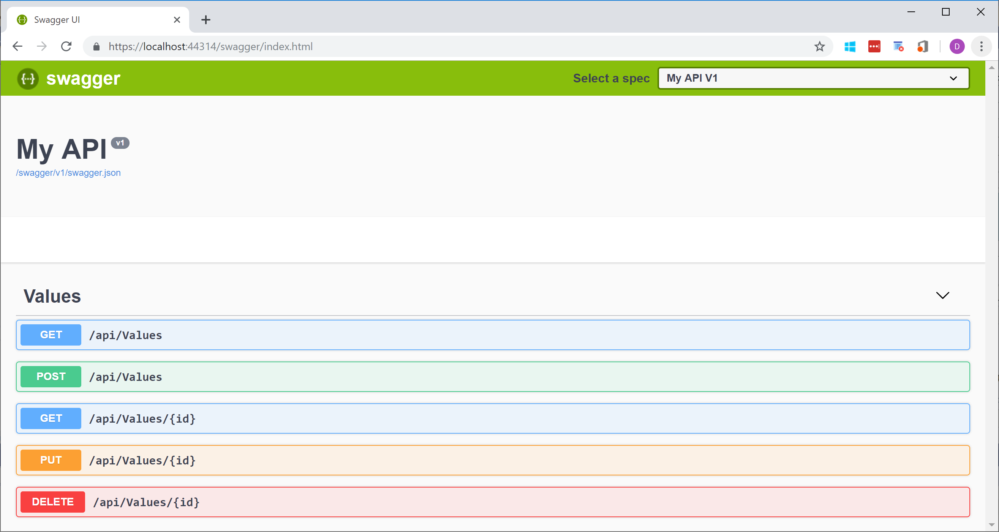

Let's suppose you have a Asp.Net Core application and you want to split the controllers in different class libraries (for example, to place the API controllers in a separate project, but another case could be when you may want to partition by areas).
The MVC runtime won't automatically pick up the controllers of the external class libraries, even if you add a reference to these projects.

In your ConfigureServices you will need to call the [AddApplicationPart](https://docs.microsoft.com/en-us/dotnet/api/microsoft.extensions.dependencyinjection.mvccoremvcbuilderextensions.addapplicationpart?view=aspnetcore-2.2) extension method, for each of the external assemblies you want to load:

```csharp
// This method gets called by the runtime. Use this method to add services to the container.
public void ConfigureServices(IServiceCollection services)
{
    ...

    services.AddMvc()
        .SetCompatibilityVersion(CompatibilityVersion.Version_2_2)
        .AddApplicationPart(typeof(ValuesController).Assembly);

    ...
}
````

You see from the Swagger below that my MVC web application has picked up the ValuesController defined in the class library dedicated to the API controllers:

